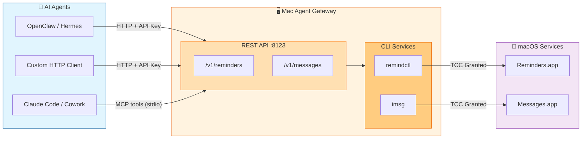
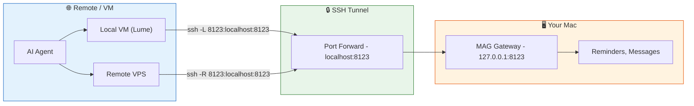
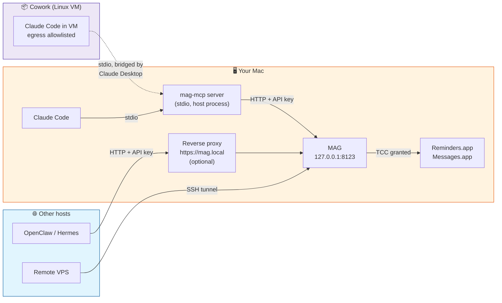
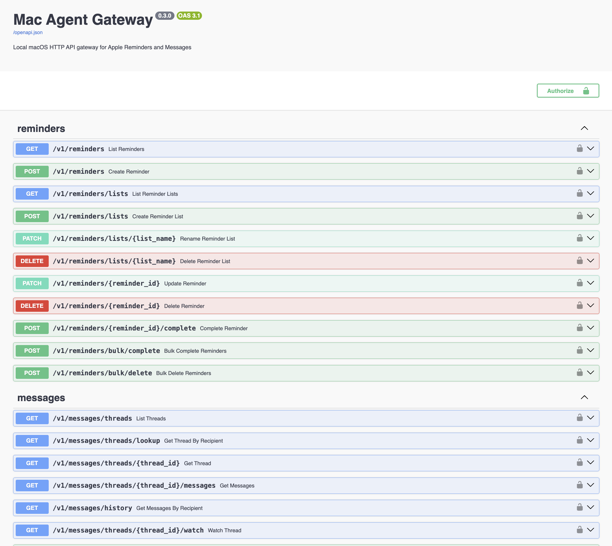

# Mac Agent Gateway (MAG)

[](https://www.python.org/downloads/)
[](https://opensource.org/licenses/MIT)
[](https://fastapi.tiangolo.com)

A local macOS HTTP API gateway that exposes Apple-protected capabilities (Reminders, Messages) via a stable, agent-friendly REST API.

## Why MAG?

Modern AI agents running in VMs, containers, or remote hosts cannot access macOS-protected services due to:

- **TCC Permission Enforcement** — Apple restricts access to Reminders, Messages, etc.
- **Sandbox Restrictions** — VMs and containers can't invoke macOS CLIs
- **Fragile CLI Integration** — Direct CLI execution from agents is unreliable

MAG solves this by running on your Mac as a secure HTTP gateway, handling all TCC permissions and CLI execution while exposing clean REST endpoints.

### What This Means for You

**In plain terms:** MAG lets AI assistants work with your Apple Reminders and Messages—apps that are normally locked to your Mac—in a controlled, secure way.

- **Your AI assistant can now help with real tasks** — "Add a reminder for tomorrow", "Find the links Jane sent me last week", "Text me my todo list"
- **Works with any AI agent** — OpenClaw, Claude Code, Cursor, or any tool that can make HTTP requests
- **You stay in control** — Choose exactly what the AI can do: read-only access, send only to specific contacts, or full access
- **No cloud required** — Everything runs locally on your Mac; your data never leaves your computer
- **Built on trusted tools** — Uses popular open-source CLIs ([remindctl](https://github.com/keith/reminders-cli), [imsg](https://github.com/chrisbrandow/imsg)) with a standard REST API on top

**Example permissions you can set:**
- Allow reading messages but not sending
- Allow sending only to yourself or specific contacts
- Allow reminders but disable message access entirely

**Try prompts like these with your AI agent:**
- *"What's on my todo list for today?"*
- *"Find the last 20 Trulia links my wife sent me and organize them by state and city"*
- *"Create a reminder for tomorrow at 9am to call the dentist"*
- *"Text me a summary of my overdue reminders"*
- *"Search my messages with John for anything about the project"*
- *"Find the last restaurant link Jane sent me, look it up, and text me the hours and address"*

See **[EXAMPLES.md](EXAMPLES.md)** for 21+ real-world prompts and workflows.


```mermaid
flowchart LR
    subgraph Agents["🤖 AI Agents"]
        direction TB
        A1["OpenClaw / Hermes"]
        A2["Claude Code / Cowork"]
        A3["Custom HTTP Client"]
    end

    subgraph Gateway["🖥️ Mac Agent Gateway"]
        direction TB
        subgraph API["REST API :8123"]
            R["/v1/reminders"]
            M["/v1/messages"]
        end
        subgraph Services["CLI Services"]
            RC["remindctl"]
            IM["imsg"]
        end
        API --> Services
    end

    subgraph Apple["🍎 macOS Services"]
        direction TB
        REM["Reminders.app"]
        MSG["Messages.app"]
    end

    A1 & A3 -->|"HTTP + API Key"| API
    A2 -->|"MCP tools (stdio)"| API
    RC -->|"TCC Granted"| REM
    IM -->|"TCC Granted"| MSG

    style Agents fill:#e1f5fe,stroke:#01579b
    style Gateway fill:#fff3e0,stroke:#e65100
    style Apple fill:#f3e5f5,stroke:#7b1fa2
    style API fill:#ffe0b2,stroke:#ff6f00
    style Services fill:#ffcc80,stroke:#ef6c00
```

**Key Principle:** Agents never execute Apple binaries. The gateway owns all permissions and CLI execution.

### Remote Access: VMs and VPS

MAG runs on your Mac but can be securely accessed from local VMs (like [Lume](https://lume.dev)) or remote VPS instances via SSH tunneling:


```mermaid
flowchart LR
    subgraph Remote["🌐 Remote / VM"]
        direction TB
        VM["Local VM (Lume)"]
        VPS["Remote VPS"]
        Agent["AI Agent"]
    end

    subgraph Tunnel["🔒 SSH Tunnel"]
        SSH["Port Forward - localhost:8123"]
    end

    subgraph Mac["🖥️ Your Mac"]
        MAG["MAG Gateway - 127.0.0.1:8123"]
        Apps["Reminders, Messages"]
        MAG --> Apps
    end

    VM -->|"ssh -L 8123:localhost:8123"| SSH
    VPS -->|"ssh -R 8123:localhost:8123"| SSH
    SSH --> MAG
    Agent --> VM
    Agent --> VPS

    style Remote fill:#e3f2fd,stroke:#1565c0
    style Tunnel fill:#e8f5e9,stroke:#2e7d32
    style Mac fill:#fff3e0,stroke:#e65100
```

**Common scenarios:**

| Scenario | SSH Command (run on...) | Result |
|----------|------------------------|--------|
| Local VM → Mac | `ssh -L 8123:localhost:8123 mac-host` (on VM) | VM accesses MAG at `localhost:8123` |
| VPS → Mac | `ssh -R 8123:localhost:8123 vps-host` (on Mac) | VPS accesses MAG at `localhost:8123` |

This keeps MAG secure (localhost-only) while enabling remote agents to use it through encrypted tunnels.

**Tailscale / ZeroTier (alternative):**

For persistent remote access without maintaining SSH sessions, a mesh VPN like [Tailscale](https://tailscale.com) or [ZeroTier](https://zerotier.com) is a reliable option:

```bash
# Bind MAG to all interfaces (required for Tailscale access)
MAG_HOST=0.0.0.0 make run

# Access via your Tailscale IP (e.g., 100.x.x.x)
curl -H "X-API-Key: $KEY" http://100.x.x.x:8123/health
```

> **Note:** This configuration has not been personally tested by the author, but is a well-established pattern for secure remote access.

> **Security consideration:** Binding to `0.0.0.0` exposes MAG beyond localhost. While Tailscale's private network limits exposure, anyone on your tailnet (or who guesses your API key) could access the gateway. Mitigations:
> - Use a strong, randomly-generated API key (32+ characters)
> - Consider Tailscale ACLs to restrict which devices can reach your Mac
> - Use the send allowlist to limit message recipients even if compromised

## Features

- **Apple Reminders API** — Full CRUD: create, list, update, complete, delete reminders and lists
- **Apple Messages API** — Send/reply to iMessages, list threads, search messages, extract links, stream new messages
- **Attachment Downloads** — Download photos and files from messages via secure REST API
- **OpenAPI/Swagger** — Auto-generated docs at `/docs` and `/openapi.json`
- **Agent Skills** — Portable skill definitions for OpenClaw (formerly Clawdbot/Moltbot), Cursor, and other agents
- **Secure by Default** — Localhost-only binding, API key auth, rate limiting, CORS protection, audit logging
- **PII Filtering** — Automatic masking of sensitive data (SSNs, credit cards, passwords) in messages
- **Extensible** — Modular architecture for adding new Apple capabilities

## Quick Start

```bash
# 1. Clone the repository
git clone https://github.com/ericblue/mac-agent-gateway.git
cd mac-agent-gateway

# 2. Install CLI dependencies (Homebrew)
make install-deps  # Installs remindctl and imsg

# 3. Install MAG (creates venv and installs Python dependencies)
make install

# 4. Configure
cp .env.example .env
make generate-api-key  # Generate a secure key
# Edit .env and paste your generated key

# 5. Run
make dev  # Development mode with auto-reload
```

The gateway is now running at `http://localhost:8123`. Visit `/docs` for the interactive API documentation.

> **Note:** `make install` creates a virtual environment at `.venv/` and installs all dependencies there. All `make` commands use this venv automatically.

## Prerequisites

- **macOS** (required for Apple services access)
- **Python 3.11+**
- **Homebrew**

When first running, macOS will prompt you to grant Reminders and Messages permissions to Terminal/iTerm. The Messages integration also requires **Full Disk Access** for your terminal app (see [Troubleshooting](#full-disk-access-messages)). If using `screen` or `tmux`, those binaries need Full Disk Access as well.

## Installation

### 1. Install CLI Dependencies

```bash
make install-deps
```

This installs:
- [`remindctl`](https://github.com/keith/reminders-cli) — Apple Reminders CLI
- [`imsg`](https://github.com/chrisbrandow/imsg) — Apple Messages CLI

### 2. Install MAG

```bash
make install
```

### 3. Configure Environment

```bash
cp .env.example .env

# Generate a secure API key (recommended)
make generate-api-key
```

Edit `.env` with your generated key:

```bash
# Required (minimum 16 characters, 32+ recommended)
MAG_API_KEY=your-generated-key-here

# Server settings
MAG_HOST=127.0.0.1               # Default: localhost only
MAG_PORT=8123                    # Default port
MAG_LOG_LEVEL=INFO               # DEBUG, INFO, WARNING, ERROR

# Audit logging (optional but recommended)
MAG_LOG_DIR=./logs               # Enable file logging
MAG_LOG_ACCESS=true              # Log HTTP requests

# Capability restrictions (all enabled by default)
MAG_MESSAGES_SEND=true           # Enable/disable sending messages
MAG_MESSAGES_READ=true           # Enable/disable reading messages
MAG_MESSAGES_ATTACHMENTS=true    # Enable/disable attachment downloads
MAG_REMINDERS_READ=true          # Enable/disable reading reminders
MAG_REMINDERS_WRITE=true         # Enable/disable writing reminders

# Security restrictions (optional)
MAG_MESSAGES_SEND_ALLOWLIST=+15551234567,user@example.com  # Limit recipients
MAG_ATTACHMENT_ALLOWED_DIRS=~/Downloads,~/Pictures         # Limit attachment sources
```

See `.env.example` for all available options.

## Usage

### Running the Gateway

```bash
# Development mode (auto-reload)
make dev

# Production mode
make run

# Or directly via Python
mag
```

### Testing the API

```bash
# Health check (no auth required)
curl http://localhost:8123/health

# List today's reminders
curl -H "X-API-Key: your-key" "http://localhost:8123/v1/reminders?filter=today"

# Create a reminder
curl -X POST \
  -H "X-API-Key: your-key" \
  -H "Content-Type: application/json" \
  -d '{"title": "Call mom", "due": "tomorrow", "list": "Personal"}' \
  http://localhost:8123/v1/reminders

# Send an iMessage
curl -X POST \
  -H "X-API-Key: your-key" \
  -H "Content-Type: application/json" \
  -d '{"to": "+15551234567", "text": "On my way!"}' \
  http://localhost:8123/v1/messages/send
```

### Running as a Service (launchd)

To run MAG automatically on startup, install it as a launchd **user agent**.

> **Why not Docker?** MAG cannot run in a container. Its whole job is to invoke
> `remindctl` and `imsg`, which read Reminders and `~/Library/Messages/chat.db`
> through macOS TCC. Docker Desktop runs a Linux VM with no Reminders.app, no
> Messages.app, and no TCC, so a containerized MAG has nothing to talk to. For
> the same reason it must be a LaunchAgent (user GUI session), not a
> LaunchDaemon. If you want MAG behind a reverse proxy, run MAG natively and
> point the proxy at it — see [Behind a reverse proxy](#behind-a-reverse-proxy).

**Quickest path — generate and start the service in one step:**

```bash
make service-install-auto
```

This reads `MAG_API_KEY` from `.env`, writes
`~/Library/LaunchAgents/com.ericblue.mag.plist` with this repo's absolute paths
(mode 600), and starts it. Re-run it any time to redeploy after a config change.

<details>
<summary>Manual install (edit the plist yourself)</summary>

**1. Copy and customize the plist:**

```bash
# Copy the template
cp launchd/com.ericblue.mag.plist ~/Library/LaunchAgents/

# Edit the plist to set your paths and API key
# Update: WorkingDirectory, PYTHONPATH, MAG_API_KEY
nano ~/Library/LaunchAgents/com.ericblue.mag.plist
```

**2. Load the service:**

```bash
# Load and start the service
launchctl load ~/Library/LaunchAgents/com.ericblue.mag.plist

# Verify it's running
curl http://localhost:8123/health
```

**3. Manage the service:**

```bash
# Stop the service
launchctl unload ~/Library/LaunchAgents/com.ericblue.mag.plist

# Restart (unload + load)
launchctl unload ~/Library/LaunchAgents/com.ericblue.mag.plist
launchctl load ~/Library/LaunchAgents/com.ericblue.mag.plist

# View logs (stored in project logs/ directory)
tail -f logs/mag.log
tail -f logs/mag.error.log
```

</details>

**Makefile shortcuts:**

```bash
make service-install-auto # Generate plist from .env + repo path, then start (recommended)
make service-install   # Copy the template to LaunchAgents (then edit it by hand)
make service-start     # Load and start the service
make service-stop      # Stop the service
make service-restart   # Restart the service
make service-status    # Check if running + health check
make service-logs      # Tail the log files
make service-uninstall # Remove the plist
```

> **Security Notes:**
> - The service runs as your user (LaunchAgent), which is required for TCC permissions. Do not use LaunchDaemons (system-level) as they cannot access Reminders/Messages.
> - `make service-install` sets the plist to mode 600 (owner-only) to protect your API key.
> - Logs are stored in `logs/` within the project directory, not world-readable `/tmp`.
> - launchd's default `PATH` is only `/usr/bin:/bin:/usr/sbin:/sbin`, which excludes
>   Homebrew. The plist sets `PATH` explicitly so `remindctl` and `imsg` resolve.

### Behind a reverse proxy

MAG stays bound to `127.0.0.1` and a reverse proxy fronts it with a friendly
hostname and TLS. Docker Desktop proxies `host.docker.internal` to the host's
loopback interface, so a proxy running in a container reaches MAG without MAG
ever binding a routable address.

Example, using [Traefik](https://traefik.io) to serve MAG at `https://mag.local`:

```yaml
# dynamic.yml
http:
  routers:
    mag:
      rule: Host(`mag.local`)
      service: mag
      tls: {}
  services:
    mag:
      loadBalancer:
        servers:
          - url: http://host.docker.internal:8123
```

```bash
# Resolve the hostname locally
sudo sh -c 'echo "127.0.0.1   mag.local" >> /etc/hosts'
```

```bash
# Point shell clients and skills at the proxied URL
export MAG_URL="https://mag.local"
curl -H "X-API-Key: $MAG_API_KEY" "$MAG_URL/v1/capabilities"
```

> **Python clients need the CA explicitly.** `curl` and browsers trust a mkcert certificate
> because it is installed in the macOS keychain; Python uses the `certifi` bundle instead and
> will fail with `CERTIFICATE_VERIFY_FAILED` against the same URL. Either export
> `SSL_CERT_FILE="$(mkcert -CAROOT)/rootCA.pem"` (or `MAG_MCP_CA_BUNDLE` for the MCP server),
> or point Python clients at `http://127.0.0.1:8123` directly. The bundled MCP server defaults
> to loopback for exactly this reason — and to avoid depending on the proxy container being up.

> **Note on TLS certificates:** a `*.local` wildcard certificate is **not**
> sufficient. OpenSSL and browsers refuse to match a wildcard against a
> single-label parent domain, so `*.local` will not validate for `mag.local`.
> Issue the certificate with `mag.local` as an explicit SAN:
>
> ```bash
> mkcert "*.local" mag.local   # plus any other hosts you serve
> ```

> **Security:** the proxy listens on all interfaces, so MAG becomes reachable
> from your LAN (it was loopback-only before). The `X-API-Key` requirement still
> applies to every endpoint except `/health`. Consider setting
> `MAG_MESSAGES_SEND_ALLOWLIST` and disabling unused capabilities before
> exposing MAG this way.

## How agents connect

MAG is reachable two ways, and which one a client uses is dictated by **where that client's
code actually runs** — not by preference.


```mermaid
flowchart LR
    subgraph Host["🖥️ Your Mac"]
        direction TB
        CC["Claude Code"]
        MCPS["mag-mcp server<br/>(stdio, host process)"]
        MAG["MAG<br/>127.0.0.1:8123"]
        PROXY["Reverse proxy<br/>https://mag.local<br/>(optional)"]
        APPLE["Reminders.app<br/>Messages.app"]
    end

    subgraph VM["📦 Cowork (Linux VM)"]
        CW["Claude Code in VM<br/>egress allowlisted"]
    end

    subgraph Net["🌐 Other hosts"]
        direction TB
        OC["OpenClaw / Hermes"]
        VPS["Remote VPS"]
    end

    CC -->|stdio| MCPS
    CW -.->|"stdio, bridged by<br/>Claude Desktop"| MCPS
    MCPS -->|"HTTP + API key"| MAG
    OC -->|"HTTP + API key"| PROXY
    VPS -->|"SSH tunnel"| MAG
    PROXY --> MAG
    MAG -->|"TCC granted"| APPLE

    style Host fill:#fff3e0,stroke:#e65100
    style VM fill:#ede7f6,stroke:#4527a0
    style Net fill:#e1f5fe,stroke:#01579b
```

### The two paths

| Path | Who uses it | Transport |
|---|---|---|
| **MCP tools** | Claude Code, Cowork | stdio to a server running **on the Mac**, which then calls MAG over loopback |
| **HTTP REST** | OpenClaw, Hermes, remote VPS, any HTTP client | direct to `127.0.0.1:8123`, a reverse proxy, or an SSH tunnel |

The MCP server is not a second gateway. It is a thin translation layer that runs beside MAG on
the host and forwards to the same REST API, so both paths hit identical capability checks,
the same send allowlist, and the same TCC-backed CLIs.

### Why Cowork needs MCP specifically

Cowork runs its agent inside a **Linux VM with an allowlisted egress**. That VM has no route to
the host's loopback interface and no macOS services of its own, so `curl http://localhost:8123`
fails there regardless of how MAG is configured — and a reverse proxy does not help, because
the problem is the VM boundary, not the hostname.

What crosses that boundary is stdio. Claude Desktop launches `run.sh` **on the host** and relays
MCP messages into the VM, so the process holding the API key, the TCC grants, and the loopback
connection to MAG never leaves your Mac. Nothing about the URL is visible to, or reachable from,
the VM.

This is also why MAG itself cannot be containerized: Reminders and Messages are gated by macOS
TCC, which only grants access to a process in your user's GUI session.

### Skills work on both paths

The bundled skills (`skills/mag-reminders`, `skills/mag-messages`) are written to prefer MCP
tools when a session exposes them and fall back to the documented `curl` recipes when it does
not — so the same skill file serves Claude Code, Cowork, and an HTTP-only agent like OpenClaw.

Two rules matter when writing your own:

- **Do not hard-code an MCP tool-name prefix.** It is `mcp__mag-mcp__<tool>` in Claude Code and
  `mcp__remote-devices__mag-mcp__<tool>` in Cowork, and it will change again. Search for the
  short name (`mag_status`, `reminders_list`) and call whatever matches.
- **Do not fall back to `curl` in Cowork.** It cannot work there. A skill that quietly retries
  over HTTP will appear to hang or start improvising answers instead of reporting that the
  tools are missing.

## MCP server setup

The MCP server ships with MAG (`src/mag_mcp/`). It exposes 18 tools covering reminders
(read + write), messages (read), sending, and a `mag_status` discovery tool.

```bash
make mcp-install            # install the mcp extra into the venv
make mcp-register-code      # register with Claude Code (user scope: every project)
make mcp-register-desktop   # register with Claude Desktop, which bridges into Cowork
make mcp-check              # verify the tools load and MAG is reachable
```

Claude Code picks the server up on the next session; Claude Desktop needs a full quit and
reopen. Verify with `claude mcp list`, or by asking either client to call `mag_status`.

### Configuration

| Variable | Default | Purpose |
|---|---|---|
| `MAG_URL` | `http://127.0.0.1:8123` | Where the server reaches MAG |
| `MAG_API_KEY` | *(from `.env`)* | Read by `run.sh`; never exposed to the agent |
| `MAG_MCP_CA_BUNDLE` | *(unset)* | CA bundle when `MAG_URL` is https (see below) |
| `MAG_MCP_TIMEOUT` | `60` | Seconds; raise for large `scan_limit` searches |
| `MAG_MCP_ATTACHMENT_DIR` | `~/Downloads/mag-mcp` | Where downloaded attachments land |

`run.sh` pins `MAG_URL` to loopback deliberately. It keeps a `MAG_URL` exported in your shell
from redirecting the server at a scheme it cannot use, and it avoids making the tools depend on
a reverse-proxy container being up. To route through the proxy anyway, set
`MAG_URL_OVERRIDE=https://mag.local` **and** `MAG_MCP_CA_BUNDLE="$(mkcert -CAROOT)/rootCA.pem"`.

### Sending

`messages_send` and `messages_reply` are exposed, but sending is outward-facing and cannot be
recalled — and these tools are reachable from Cowork. Set `MAG_MESSAGES_SEND_ALLOWLIST` before
relying on them:

```bash
MAG_MESSAGES_SEND_ALLOWLIST=+15551234567
```

MAG enforces the allowlist server-side and refuses anything off it with a 403 naming the
recipient, so the guarantee does not depend on the MCP server or on a skill behaving well.
`messages_send` also accepts `dry_run=True`, which returns the exact command without sending.

Every call appends a metadata-only line to `~/.config/mag-mcp/audit.jsonl` (no message bodies).

## API Reference

All endpoints except `/health` and `/openapi.json` require the `X-API-Key` header.

Interactive API documentation is available at `/docs` (Swagger UI) and `/redoc` (ReDoc):



### System Endpoints

| Method | Path | Description |
|--------|------|-------------|
| GET | `/` | Web UI homepage |
| GET | `/health` | Health check (no auth) |
| GET | `/v1/capabilities` | Discover enabled capabilities |
| GET | `/docs` | Swagger UI |
| GET | `/redoc` | ReDoc documentation |
| GET | `/openapi.json` | OpenAPI specification |

### Reminders API

| Method | Path | Description |
|--------|------|-------------|
| GET | `/v1/reminders` | List reminders with filters |
| POST | `/v1/reminders` | Create a reminder |
| PATCH | `/v1/reminders/{id}` | Update a reminder |
| POST | `/v1/reminders/{id}/complete` | Mark as complete |
| DELETE | `/v1/reminders/{id}` | Delete a reminder |
| POST | `/v1/reminders/bulk/complete` | Bulk complete |
| POST | `/v1/reminders/bulk/delete` | Bulk delete |
| GET | `/v1/reminders/lists` | List all reminder lists |
| POST | `/v1/reminders/lists` | Create a list |
| PATCH | `/v1/reminders/lists/{name}` | Rename a list |
| DELETE | `/v1/reminders/lists/{name}` | Delete a list |

**Filter Options:**
- `filter` — `today`, `tomorrow`, `week`, `overdue`, `upcoming`, `completed`, `all`
- `date` — Specific date (`YYYY-MM-DD`)
- `list` — Filter by list name

**Reminder Fields:**
- `title` — Reminder text
- `list` — Target list name
- `due` — Due date (ISO 8601 or natural: `today`, `tomorrow`, `next week`)
- `notes` — Additional notes
- `priority` — `0` (none), `1` (high), `5` (medium), `9` (low)

### Messages API

| Method | Path | Description |
|--------|------|-------------|
| GET | `/v1/messages/threads` | List message threads |
| GET | `/v1/messages/threads/lookup` | Find thread by recipient |
| GET | `/v1/messages/threads/{id}` | Get thread by ID |
| GET | `/v1/messages/threads/{id}/messages` | Get thread messages |
| GET | `/v1/messages/threads/{id}/watch` | Watch for new messages (SSE) |
| GET | `/v1/messages/history` | Get messages by recipient |
| POST | `/v1/messages/send` | Send an iMessage |
| POST | `/v1/messages/reply` | Reply to thread or recipient |
| GET | `/v1/messages/search` | Search messages |
| GET | `/v1/messages/links` | Extract links from messages |
| GET | `/v1/messages/attachments/download` | Download an attachment file |
| GET | `/v1/messages/attachments/info` | Get attachment file info |

**Attachments:**

To download attachments (photos, files) from messages:

```bash
# 1. Get messages with attachment metadata
curl -H "X-API-Key: $KEY" \
  "http://localhost:8123/v1/messages/history?recipient=%2B15551234567&attachments=true"

# 2. Download using the original_path from the response
curl -H "X-API-Key: $KEY" \
  "http://localhost:8123/v1/messages/attachments/download?path=/Users/you/Library/Messages/Attachments/..." \
  --output photo.jpg
```

> **Security:** Only files within `~/Library/Messages/Attachments/` can be downloaded.

**Contacts Cache:**

| Method | Path | Description |
|--------|------|-------------|
| POST | `/v1/messages/contacts/upsert` | Create/update contact |
| GET | `/v1/messages/contacts/resolve` | Resolve contact by phone/email/name |
| GET | `/v1/messages/contacts/search` | Search contacts |
| GET | `/v1/messages/contacts` | List all contacts |
| DELETE | `/v1/messages/contacts/{id}` | Delete contact |

**Query Parameters:**
- `recipient` — Phone number, email, or iMessage handle
- `limit` — Maximum results to return
- `days_back` — Days of history to search (default: 365)
- `start` / `end` — Date range filter (ISO 8601)

## Agent Skills

MAG includes portable skill definitions that enable AI agents to use the API without platform-specific code.

### Available Skills

| Skill | Path | Description |
|-------|------|-------------|
| mag-reminders | `skills/mag-reminders/SKILL.md` | Apple Reminders management |
| mag-messages | `skills/mag-messages/SKILL.md` | Apple Messages (iMessage) management |

Skills are compatible with:
- **OpenClaw (formerly Clawdbot/Moltbot)** — Via YAML frontmatter metadata
- **Cursor / Claude Code** — Via markdown skill format
- **Any HTTP-capable agent** — Via curl examples

### Installing Skills

**For Claude Code:**

```bash
# Install all skills to ~/.claude/skills/
make claude-skill-install

# Check installation status
make claude-skill-check

# Then in Claude Code, use:
#   /add ~/.claude/skills/mag-reminders/SKILL.md
#   /add ~/.claude/skills/mag-messages/SKILL.md
```

**For OpenClaw (Manual):**

```bash
# Clone and copy to your agent's skills directory
git clone https://github.com/ericblue/mac-agent-gateway.git
cp -r mac-agent-gateway/skills/mag-reminders ~/.moltbot/skills/
# Or: cp -r mac-agent-gateway/skills/mag-reminders ~/.openclaw/skills/
```

**For OpenClaw (Agent-Assisted):**

Clone the repo, then prompt your agent:

```bash
git clone https://github.com/ericblue/mac-agent-gateway.git ~/Development/mac-agent-gateway
```

> "Install the skill from ~/Development/mac-agent-gateway/skills/mag-reminders/SKILL.md"

**Direct from GitHub:**

Prompt your agent:

> "Install the mag-reminders skill from https://github.com/ericblue/mac-agent-gateway"

### OpenClaw Installation

For **OpenClaw** (formerly Clawdbot/Moltbot), there are two locations to configure:

| What | Location | Purpose |
|------|----------|---------|
| Skill files | `~/clawd/skills/` | SKILL.md files with API docs |
| Credentials | `~/.clawdbot/clawdbot.json` | MAG_URL, MAG_API_KEY, enabled status |

Use the Makefile targets:

```bash
# 1. Install skill files to ~/clawd/skills/
make openclaw-skill-install

# Or specify a custom skills directory:
# make openclaw-skill-install OPENCLAW_SKILLS_DIR=~/.clawdbot/skills

# 2. Configure credentials in ~/.clawdbot/clawdbot.json
make openclaw-skill-config MAG_URL=http://localhost:8123 MAG_API_KEY=your-secret-api-key

# 3. Verify both locations
make openclaw-skill-check MAG_URL=http://localhost:8123
```

After configuration, restart/reload OpenClaw so it picks up the changes.

**Manual configuration** (alternative):

Add this to `~/.clawdbot/clawdbot.json`:

```json
{
  "skills": {
    "entries": {
      "mag-reminders": {
        "enabled": true,
        "env": {
          "MAG_URL": "http://localhost:8123",
          "MAG_API_KEY": "your-secret-api-key-here"
        }
      },
      "mag-messages": {
        "enabled": true,
        "env": {
          "MAG_URL": "http://localhost:8123",
          "MAG_API_KEY": "your-secret-api-key-here"
        }
      }
    }
  }
}
```

### Using the OpenAPI Spec

Agents can also generate tools directly from the OpenAPI specification:

```bash
curl http://localhost:8123/openapi.json
```

## Security

For detailed security information, see **[SECURITY.md](SECURITY.md)**.

### Localhost-Only (Default)

By default, MAG binds to `127.0.0.1`, accepting only local connections. This is the recommended configuration.

### Remote Access

For agents running on VMs or remote hosts:

**Option 1: SSH Tunnel (Recommended)**

```bash
# Option A: From the agent VM, tunnel to the Mac host
# Run this ON THE VM/AGENT machine
ssh -L 8123:localhost:8123 user@mac-host

# Option B: From the Mac host, reverse tunnel to the VM
# Run this ON THE MAC HOST
ssh -R 8123:localhost:8123 user@agent-vm

# Either way, the agent can now access http://localhost:8123
```

**Option 2: Bind to Network Interface**

```bash
MAG_HOST=0.0.0.0 make run
```

> ⚠️ **Warning:** Binding to `0.0.0.0` exposes the API to your network. Ensure you:
> - Use a strong, unique API key
> - Restrict access via firewall rules
> - Consider HTTPS via a reverse proxy (nginx, Caddy)

### API Key Authentication

All protected endpoints require the `X-API-Key` header:

```bash
curl -H "X-API-Key: your-secret-key" http://localhost:8123/v1/reminders
```

### Capability Restrictions

Fine-grained access control via environment variables:

| Variable | Default | Description |
|----------|---------|-------------|
| `MAG_MESSAGES_READ` | true | List threads, get message history |
| `MAG_MESSAGES_SEARCH` | true | Search messages, extract links |
| `MAG_MESSAGES_SEND` | true | Send messages, reply to threads |
| `MAG_MESSAGES_WATCH` | true | Stream new messages (SSE) |
| `MAG_MESSAGES_CONTACTS` | true | Manage contacts cache |
| `MAG_MESSAGES_ATTACHMENTS` | true | Download message attachments |
| `MAG_REMINDERS_READ` | true | List reminders and lists |
| `MAG_REMINDERS_WRITE` | true | Create, update, delete reminders |

Agents can discover enabled capabilities via `GET /v1/capabilities`.

### Rate Limiting

The API includes rate limiting to prevent abuse:

- **Global limit:** 100 requests per minute per IP
- **Send endpoints:** 10 requests per minute per IP (for `/send` and `/reply`)

When rate limited, the API returns `429 Too Many Requests`.

### Audit Logging

Enable file-based access logging for security monitoring:

```bash
MAG_LOG_DIR=./logs      # Enable file logging
MAG_LOG_ACCESS=true     # Log all HTTP requests
```

Access logs record: timestamp, client IP, method, path, status, and duration.

### Send Allowlist

Restrict message sending to specific recipients:

```bash
# Only allow sending to these phone numbers/emails
MAG_MESSAGES_SEND_ALLOWLIST=+15551234567,+15559876543,user@example.com
```

If set, any attempt to send to a recipient not in the list returns `403 Forbidden`. Leave empty (default) to allow all recipients.

## Development

```bash
# Run tests
make test

# Run linter
make lint

# Format code
make format

# Clean build artifacts
make clean
```

### Project Structure

```
mac-agent-gateway/
├── src/mag/
│   ├── main.py          # FastAPI app entry point
│   ├── config.py        # Configuration management
│   ├── auth.py          # API key authentication
│   ├── models/          # Pydantic models
│   ├── routers/         # API route handlers
│   ├── services/        # CLI wrapper services
│   └── templates/       # Web UI templates
├── skills/              # Agent skill definitions
├── tests/               # Test suite
└── docs/                # Documentation
```

## Roadmap

- [x] **v0.1** — Reminders CRUD, Messages send, API key auth
- [x] **v0.2** — Full Messages API (threads, history, search, reply, links, SSE streaming)
- [ ] **v0.3** — Calendar integration
- [ ] **v0.4** — Contacts integration (system contacts)
- [ ] **v0.5** — MCP (Model Context Protocol) server mode
- [ ] **v1.0** — Plugin registry for custom capabilities

## Examples & Prompts

See **[EXAMPLES.md](EXAMPLES.md)** for 21+ real-world prompts you can use with AI agents, including:

- Daily reminder digests
- Message search and link extraction
- Creating reminders from messages
- Sending notifications via iMessage
- Combined workflows (capture → action → notify)

## Troubleshooting

### TCC Permission Issues

If you see "access denied" errors:

1. Open **System Settings → Privacy & Security → Reminders** (or Messages)
2. Ensure Terminal/iTerm is checked
3. Restart the gateway

### Full Disk Access (Messages)

The `imsg` CLI reads `~/Library/Messages/chat.db`, which requires **Full Disk Access** — not just the "Messages" privacy category. If you see `permissionDenied` or `authorization denied (code: 23)` errors:

1. Open **System Settings → Privacy & Security → Full Disk Access**
2. Enable it for your **terminal application** — this is usually the program that needs access (e.g., iTerm2, Terminal.app, Ghostty, Hyper, cmux, etc.)
3. If running the gateway inside a terminal multiplexer like **`screen`** or **`tmux`**, those binaries may also need Full Disk Access (e.g., `/usr/local/bin/screen` or `/usr/local/bin/tmux`)
4. Restart your terminal and the gateway after granting access

### CLI Not Found

```bash
# Reinstall dependencies
make install-deps

# Verify installation
which remindctl
which imsg
```

### Connection Refused

```bash
# Check if gateway is running
curl http://localhost:8123/health

# Check port availability
lsof -i :8123
```

## Contributing

Contributions are welcome! Please:

1. Fork the repository
2. Create a feature branch (`git checkout -b feature/amazing-feature`)
3. Commit your changes (`git commit -m 'Add amazing feature'`)
4. Push to the branch (`git push origin feature/amazing-feature`)
5. Open a Pull Request

## License

MIT License — see [LICENSE](LICENSE) for details.

## Acknowledgments

- [remindctl](https://github.com/keith/reminders-cli) — Apple Reminders CLI by Keith Smiley
- [imsg](https://github.com/chrisbrandow/imsg) — Apple Messages CLI by Chris Brandow

## Version History

| Version   | Date       | Description     |
| --------- | ---------- | --------------- |
| **0.4.0** | 2026-09-06 | MCP server (Claude Code + Cowork) + startup service |
| **0.3.0** | 2026-01-31 | Security hardening + Attachment downloads |
| **0.2.0** | 2026-01-31 | Enhanced Messages API |
| **0.1.0** | 2026-01-29 | Initial release |

### v0.4.0 — MCP Server + Startup Service

- **MCP server** (`src/mag_mcp/`) — 18 tools over the REST API, so MAG works in Claude Code and
  Cowork, not just from HTTP clients. Runs on the host over stdio; Claude Desktop bridges it
  into the Cowork VM, which cannot reach the host over HTTP at all.
- **Sending is allowlisted** — `messages_send` / `messages_reply` are exposed but constrained by
  `MAG_MESSAGES_SEND_ALLOWLIST`, enforced inside MAG. `dry_run` previews without sending.
- **Dual-path skills** — the bundled skills prefer MCP tools where available and fall back to
  the HTTP recipes, so one skill file serves Claude Code, Cowork, and OpenClaw.
- **`make service-install-auto`** — generates and starts the launchd agent from `.env` and the
  repo path (mode 600), replacing the hand-edited plist.
- **launchd `PATH` fix** — the shipped plist set no `PATH`, and launchd's default excludes
  Homebrew, so `remindctl` and `imsg` could not be found when run as a service.
- **Fixed `POST /v1/reminders/{id}/complete`** — returned 500 for every caller; `remindctl`
  returns a list even for one id.
- **Fixed `POST /v1/reminders/bulk/complete`** — never reached its handler; the parameterized
  route was declared first and captured `"bulk"` as a reminder id.
- **Reverse proxy docs** — including that a `*.local` wildcard cert will not validate for a
  two-label host, and that Python clients need the CA explicitly.

### v0.3.0 — Security Hardening + Attachment Downloads

- **Attachment Download API** — Download photos and files from messages via `/v1/messages/attachments/download`
- **Rate Limiting** — Global 100/min limit, 10/min for send endpoints
- **CORS Protection** — Restrictive cross-origin policy (localhost only by default)
- **Audit Logging** — Optional file-based access logging with rotation
- **Input Validation** — Path parameter validation to prevent command injection
- **Error Sanitization** — Internal error details no longer leaked to clients
- **API Key Security** — Minimum 16-character requirement, blocks common placeholders
- **File Permissions** — Contacts cache and logs created with secure permissions (600)
- **Attachment Security** — Downloads restricted to `~/Library/Messages/Attachments/`
- **Send Allowlist Privacy** — Allowlist redacted in unauthenticated `/v1/capabilities` responses
- **25 security tests** — Comprehensive test coverage for all security controls

### v0.2.0 — Enhanced Messages API

- Full Messages API: threads, history, search, reply, links extraction
- Server-Sent Events (SSE) for watching new messages
- Contacts cache with persistence
- Date range filtering with `days_back`, `start`, `end` parameters
- Recipient lookup by phone, email, or handle
- New `mag-messages` skill for agent integration
- Capability restrictions via environment variables
- Send allowlist for restricting message recipients
- Capabilities discovery endpoint (`GET /v1/capabilities`)

### v0.1.0 — Initial Release

- Apple Reminders API with full CRUD operations
- Apple Messages API (send, list conversations)
- API key authentication
- OpenAPI/Swagger documentation
- Agent skill definitions (OpenClaw, Claude Code compatible)
- Bulk operations for reminders (complete, delete)
- Reminder list management (create, rename, delete)
- launchd service support for running on startup
- Web UI landing page
- Comprehensive test suite

## About

**Mac Agent Gateway (MAG)** is a local macOS HTTP API gateway that enables AI agents running in sandboxed environments to safely access Apple-protected system services.

This project addresses a fundamental challenge: AI agents running in VMs, containers, or on remote hosts cannot access macOS TCC-protected services like Reminders and Messages. MAG bridges this gap by running on your Mac as a secure HTTP gateway, handling all permissions and CLI execution while exposing clean, agent-friendly REST endpoints.

### Design Principles

- **Security First** — Localhost-only by default, API key authentication, no arbitrary command execution
- **Agent Agnostic** — Works with any HTTP-capable agent (OpenClaw, Claude Code, custom integrations)
- **Capability Focused** — Intent-level APIs (create reminder, send message) not raw CLI access
- **Portable Skills** — Thin HTTP skills that run anywhere, no Apple binaries required

**Created by [Eric Blue](https://about.ericblue.com)**

**Repository:** [github.com/ericblue/mac-agent-gateway](https://github.com/ericblue/mac-agent-gateway)


