# Mac Agent Gateway (MAG)

[](https://www.python.org/downloads/)
[](https://opensource.org/licenses/MIT)
[](https://fastapi.tiangolo.com)

A local macOS HTTP API gateway that exposes Apple-protected capabilities (Reminders, Messages) via a stable, agent-friendly REST API.

## Why MAG?

Modern AI agents running in VMs, containers, or remote hosts cannot access macOS-protected services due to:

- **TCC Permission Enforcement** — Apple restricts access to Reminders, Messages, etc.
- **Sandbox Restrictions** — VMs and containers can't invoke macOS CLIs
- **Fragile CLI Integration** — Direct CLI execution from agents is unreliable

MAG solves this by running on your Mac as a secure HTTP gateway, handling all TCC permissions and CLI execution while exposing clean REST endpoints.

### What This Means for You

**In plain terms:** MAG lets AI assistants work with your Apple Reminders and Messages—apps that are normally locked to your Mac—in a controlled, secure way.

- **Your AI assistant can now help with real tasks** — "Add a reminder for tomorrow", "Find the links Jane sent me last week", "Text me my todo list"
- **Works with any AI agent** — OpenClaw, Claude Code, Cursor, or any tool that can make HTTP requests
- **You stay in control** — Choose exactly what the AI can do: read-only access, send only to specific contacts, or full access
- **No cloud required** — Everything runs locally on your Mac; your data never leaves your computer
- **Built on trusted tools** — Uses popular open-source CLIs ([remindctl](https://github.com/keith/reminders-cli), [imsg](https://github.com/chrisbrandow/imsg)) with a standard REST API on top

**Example permissions you can set:**
- Allow reading messages but not sending
- Allow sending only to yourself or specific contacts
- Allow reminders but disable message access entirely

**Try prompts like these with your AI agent:**
- *"What's on my todo list for today?"*
- *"Find the last 20 Trulia links my wife sent me and organize them by state and city"*
- *"Create a reminder for tomorrow at 9am to call the dentist"*
- *"Text me a summary of my overdue reminders"*
- *"Search my messages with John for anything about the project"*
- *"Find the last restaurant link Jane sent me, look it up, and text me the hours and address"*

See **[EXAMPLES.md](EXAMPLES.md)** for 21+ real-world prompts and workflows.


**Key Principle:** Agents never execute Apple binaries. The gateway owns all permissions and CLI execution.

### Remote Access: VMs and VPS

MAG runs on your Mac but can be securely accessed from local VMs (like [Lume](https://lume.dev)) or remote VPS instances via SSH tunneling:

```mermaid
flowchart LR
    subgraph Remote["🌐 Remote / VM"]
        direction TB
        VM["Local VM (Lume)"]
        VPS["Remote VPS"]
        Agent["AI Agent"]
    end

    subgraph Tunnel["🔒 SSH Tunnel"]
        SSH["Port Forward - localhost:8123"]
    end

    subgraph Mac["🖥️ Your Mac"]
        MAG["MAG Gateway - 127.0.0.1:8123"]
        Apps["Reminders, Messages"]
        MAG --> Apps
    end

    VM -->|"ssh -L 8123:localhost:8123"| SSH
    VPS -->|"ssh -R 8123:localhost:8123"| SSH
    SSH --> MAG
    Agent --> VM
    Agent --> VPS

    style Remote fill:#e3f2fd,stroke:#1565c0
    style Tunnel fill:#e8f5e9,stroke:#2e7d32
    style Mac fill:#fff3e0,stroke:#e65100
```



**Common scenarios:**

| Scenario | SSH Command (run on...) | Result |
|----------|------------------------|--------|
| Local VM → Mac | `ssh -L 8123:localhost:8123 mac-host` (on VM) | VM accesses MAG at `localhost:8123` |
| VPS → Mac | `ssh -R 8123:localhost:8123 vps-host` (on Mac) | VPS accesses MAG at `localhost:8123` |

This keeps MAG secure (localhost-only) while enabling remote agents to use it through encrypted tunnels.

**Tailscale / ZeroTier (alternative):**

For persistent remote access without maintaining SSH sessions, a mesh VPN like [Tailscale](https://tailscale.com) or [ZeroTier](https://zerotier.com) is a reliable option:

```bash
# Bind MAG to all interfaces (required for Tailscale access)
MAG_HOST=0.0.0.0 make run

# Access via your Tailscale IP (e.g., 100.x.x.x)
curl -H "X-API-Key: $KEY" http://100.x.x.x:8123/health
```

> **Note:** This configuration has not been personally tested by the author, but is a well-established pattern for secure remote access.

> **Security consideration:** Binding to `0.0.0.0` exposes MAG beyond localhost. While Tailscale's private network limits exposure, anyone on your tailnet (or who guesses your API key) could access the gateway. Mitigations:
> - Use a strong, randomly-generated API key (32+ characters)
> - Consider Tailscale ACLs to restrict which devices can reach your Mac
> - Use the send allowlist to limit message recipients even if compromised

## Features

- **Apple Reminders API** — Full CRUD: create, list, update, complete, delete reminders and lists
- **Apple Messages API** — Send/reply to iMessages, list threads, search messages, extract links, stream new messages
- **Attachment Downloads** — Download photos and files from messages via secure REST API
- **OpenAPI/Swagger** — Auto-generated docs at `/docs` and `/openapi.json`
- **Agent Skills** — Portable skill definitions for OpenClaw (formerly Clawdbot/Moltbot), Cursor, and other agents
- **Secure by Default** — Localhost-only binding, API key auth, rate limiting, CORS protection, audit logging
- **PII Filtering** — Automatic masking of sensitive data (SSNs, credit cards, passwords) in messages
- **Extensible** — Modular architecture for adding new Apple capabilities

## Quick Start

```bash
# 1. Clone the repository
git clone https://github.com/ericblue/mac-agent-gateway.git
cd mac-agent-gateway

# 2. Install CLI dependencies (Homebrew)
make install-deps  # Installs remindctl and imsg

# 3. Install MAG (creates venv and installs Python dependencies)
make install

# 4. Configure
cp .env.example .env
make generate-api-key  # Generate a secure key
# Edit .env and paste your generated key

# 5. Run
make dev  # Development mode with auto-reload
```

The gateway is now running at `http://localhost:8123`. Visit `/docs` for the interactive API documentation.

> **Note:** `make install` creates a virtual environment at `.venv/` and installs all dependencies there. All `make` commands use this venv automatically.

## Prerequisites

- **macOS** (required for Apple services access)
- **Python 3.11+**
- **Homebrew**

When first running, macOS will prompt you to grant Reminders and Messages permissions to Terminal/iTerm.

## Installation

### 1. Install CLI Dependencies

```bash
make install-deps
```

This installs:
- [`remindctl`](https://github.com/keith/reminders-cli) — Apple Reminders CLI
- [`imsg`](https://github.com/chrisbrandow/imsg) — Apple Messages CLI

### 2. Install MAG

```bash
make install
```

### 3. Configure Environment

```bash
cp .env.example .env

# Generate a secure API key (recommended)
make generate-api-key
```

Edit `.env` with your generated key:

```bash
# Required (minimum 16 characters, 32+ recommended)
MAG_API_KEY=your-generated-key-here

# Server settings
MAG_HOST=127.0.0.1               # Default: localhost only
MAG_PORT=8123                    # Default port
MAG_LOG_LEVEL=INFO               # DEBUG, INFO, WARNING, ERROR

# Audit logging (optional but recommended)
MAG_LOG_DIR=./logs               # Enable file logging
MAG_LOG_ACCESS=true              # Log HTTP requests

# Capability restrictions (all enabled by default)
MAG_MESSAGES_SEND=true           # Enable/disable sending messages
MAG_MESSAGES_READ=true           # Enable/disable reading messages
MAG_MESSAGES_ATTACHMENTS=true    # Enable/disable attachment downloads
MAG_REMINDERS_READ=true          # Enable/disable reading reminders
MAG_REMINDERS_WRITE=true         # Enable/disable writing reminders

# Security restrictions (optional)
MAG_MESSAGES_SEND_ALLOWLIST=+15551234567,user@example.com  # Limit recipients
MAG_ATTACHMENT_ALLOWED_DIRS=~/Downloads,~/Pictures         # Limit attachment sources
```

See `.env.example` for all available options.

## Usage

### Running the Gateway

```bash
# Development mode (auto-reload)
make dev

# Production mode
make run

# Or directly via Python
mag
```

### Testing the API

```bash
# Health check (no auth required)
curl http://localhost:8123/health

# List today's reminders
curl -H "X-API-Key: your-key" "http://localhost:8123/v1/reminders?filter=today"

# Create a reminder
curl -X POST \
  -H "X-API-Key: your-key" \
  -H "Content-Type: application/json" \
  -d '{"title": "Call mom", "due": "tomorrow", "list": "Personal"}' \
  http://localhost:8123/v1/reminders

# Send an iMessage
curl -X POST \
  -H "X-API-Key: your-key" \
  -H "Content-Type: application/json" \
  -d '{"to": "+15551234567", "text": "On my way!"}' \
  http://localhost:8123/v1/messages/send
```

### Running as a Service (launchd)

To run MAG automatically on startup, use the included launchd plist template.

**1. Copy and customize the plist:**

```bash
# Copy the template
cp launchd/com.ericblue.mag.plist ~/Library/LaunchAgents/

# Edit the plist to set your paths and API key
# Update: WorkingDirectory, PYTHONPATH, MAG_API_KEY
nano ~/Library/LaunchAgents/com.ericblue.mag.plist
```

**2. Load the service:**

```bash
# Load and start the service
launchctl load ~/Library/LaunchAgents/com.ericblue.mag.plist

# Verify it's running
curl http://localhost:8123/health
```

**3. Manage the service:**

```bash
# Stop the service
launchctl unload ~/Library/LaunchAgents/com.ericblue.mag.plist

# Restart (unload + load)
launchctl unload ~/Library/LaunchAgents/com.ericblue.mag.plist
launchctl load ~/Library/LaunchAgents/com.ericblue.mag.plist

# View logs (stored in project logs/ directory)
tail -f logs/mag.log
tail -f logs/mag.error.log
```

**Or use the Makefile shortcuts:**

```bash
make service-install   # Copy plist to LaunchAgents (sets secure permissions)
make service-start     # Load and start the service
make service-stop      # Stop the service
make service-restart   # Restart the service
make service-status    # Check if running + health check
make service-logs      # Tail the log files
make service-uninstall # Remove the plist
```

> **Security Notes:**
> - The service runs as your user (LaunchAgent), which is required for TCC permissions. Do not use LaunchDaemons (system-level) as they cannot access Reminders/Messages.
> - `make service-install` sets the plist to mode 600 (owner-only) to protect your API key.
> - Logs are stored in `logs/` within the project directory, not world-readable `/tmp`.

## API Reference

All endpoints except `/health` and `/openapi.json` require the `X-API-Key` header.

### System Endpoints

| Method | Path | Description |
|--------|------|-------------|
| GET | `/` | Web UI homepage |
| GET | `/health` | Health check (no auth) |
| GET | `/v1/capabilities` | Discover enabled capabilities |
| GET | `/docs` | Swagger UI |
| GET | `/redoc` | ReDoc documentation |
| GET | `/openapi.json` | OpenAPI specification |

### Reminders API

| Method | Path | Description |
|--------|------|-------------|
| GET | `/v1/reminders` | List reminders with filters |
| POST | `/v1/reminders` | Create a reminder |
| PATCH | `/v1/reminders/{id}` | Update a reminder |
| POST | `/v1/reminders/{id}/complete` | Mark as complete |
| DELETE | `/v1/reminders/{id}` | Delete a reminder |
| POST | `/v1/reminders/bulk/complete` | Bulk complete |
| POST | `/v1/reminders/bulk/delete` | Bulk delete |
| GET | `/v1/reminders/lists` | List all reminder lists |
| POST | `/v1/reminders/lists` | Create a list |
| PATCH | `/v1/reminders/lists/{name}` | Rename a list |
| DELETE | `/v1/reminders/lists/{name}` | Delete a list |

**Filter Options:**
- `filter` — `today`, `tomorrow`, `week`, `overdue`, `upcoming`, `completed`, `all`
- `date` — Specific date (`YYYY-MM-DD`)
- `list` — Filter by list name

**Reminder Fields:**
- `title` — Reminder text
- `list` — Target list name
- `due` — Due date (ISO 8601 or natural: `today`, `tomorrow`, `next week`)
- `notes` — Additional notes
- `priority` — `0` (none), `1` (high), `5` (medium), `9` (low)

### Messages API

| Method | Path | Description |
|--------|------|-------------|
| GET | `/v1/messages/threads` | List message threads |
| GET | `/v1/messages/threads/lookup` | Find thread by recipient |
| GET | `/v1/messages/threads/{id}` | Get thread by ID |
| GET | `/v1/messages/threads/{id}/messages` | Get thread messages |
| GET | `/v1/messages/threads/{id}/watch` | Watch for new messages (SSE) |
| GET | `/v1/messages/history` | Get messages by recipient |
| POST | `/v1/messages/send` | Send an iMessage |
| POST | `/v1/messages/reply` | Reply to thread or recipient |
| GET | `/v1/messages/search` | Search messages |
| GET | `/v1/messages/links` | Extract links from messages |
| GET | `/v1/messages/attachments/download` | Download an attachment file |
| GET | `/v1/messages/attachments/info` | Get attachment file info |

**Attachments:**

To download attachments (photos, files) from messages:

```bash
# 1. Get messages with attachment metadata
curl -H "X-API-Key: $KEY" \
  "http://localhost:8123/v1/messages/history?recipient=%2B15551234567&attachments=true"

# 2. Download using the original_path from the response
curl -H "X-API-Key: $KEY" \
  "http://localhost:8123/v1/messages/attachments/download?path=/Users/you/Library/Messages/Attachments/..." \
  --output photo.jpg
```

> **Security:** Only files within `~/Library/Messages/Attachments/` can be downloaded.

**Contacts Cache:**

| Method | Path | Description |
|--------|------|-------------|
| POST | `/v1/messages/contacts/upsert` | Create/update contact |
| GET | `/v1/messages/contacts/resolve` | Resolve contact by phone/email/name |
| GET | `/v1/messages/contacts/search` | Search contacts |
| GET | `/v1/messages/contacts` | List all contacts |
| DELETE | `/v1/messages/contacts/{id}` | Delete contact |

**Query Parameters:**
- `recipient` — Phone number, email, or iMessage handle
- `limit` — Maximum results to return
- `days_back` — Days of history to search (default: 365)
- `start` / `end` — Date range filter (ISO 8601)

## Agent Skills

MAG includes portable skill definitions that enable AI agents to use the API without platform-specific code.

### Available Skills

| Skill | Path | Description |
|-------|------|-------------|
| mag-reminders | `skills/mag-reminders/SKILL.md` | Apple Reminders management |
| mag-messages | `skills/mag-messages/SKILL.md` | Apple Messages (iMessage) management |

Skills are compatible with:
- **OpenClaw (formerly Clawdbot/Moltbot)** — Via YAML frontmatter metadata
- **Cursor / Claude Code** — Via markdown skill format
- **Any HTTP-capable agent** — Via curl examples

### Installing Skills

**For Claude Code:**

```bash
# Install all skills to ~/.claude/skills/
make claude-skill-install

# Check installation status
make claude-skill-check

# Then in Claude Code, use:
#   /add ~/.claude/skills/mag-reminders/SKILL.md
#   /add ~/.claude/skills/mag-messages/SKILL.md
```

**For OpenClaw (Manual):**

```bash
# Clone and copy to your agent's skills directory
git clone https://github.com/ericblue/mac-agent-gateway.git
cp -r mac-agent-gateway/skills/mag-reminders ~/.moltbot/skills/
# Or: cp -r mac-agent-gateway/skills/mag-reminders ~/.openclaw/skills/
```

**For OpenClaw (Agent-Assisted):**

Clone the repo, then prompt your agent:

```bash
git clone https://github.com/ericblue/mac-agent-gateway.git ~/Development/mac-agent-gateway
```

> "Install the skill from ~/Development/mac-agent-gateway/skills/mag-reminders/SKILL.md"

**Direct from GitHub:**

Prompt your agent:

> "Install the mag-reminders skill from https://github.com/ericblue/mac-agent-gateway"

### OpenClaw Installation

For **OpenClaw** (formerly Clawdbot/Moltbot), there are two locations to configure:

| What | Location | Purpose |
|------|----------|---------|
| Skill files | `~/clawd/skills/` | SKILL.md files with API docs |
| Credentials | `~/.clawdbot/clawdbot.json` | MAG_URL, MAG_API_KEY, enabled status |

Use the Makefile targets:

```bash
# 1. Install skill files to ~/clawd/skills/
make openclaw-skill-install

# Or specify a custom skills directory:
# make openclaw-skill-install OPENCLAW_SKILLS_DIR=~/.clawdbot/skills

# 2. Configure credentials in ~/.clawdbot/clawdbot.json
make openclaw-skill-config MAG_URL=http://localhost:8124 MAG_API_KEY=your-secret-api-key

# 3. Verify both locations
make openclaw-skill-check MAG_URL=http://localhost:8124
```

After configuration, restart/reload OpenClaw so it picks up the changes.

**Manual configuration** (alternative):

Add this to `~/.clawdbot/clawdbot.json`:

```json
{
  "skills": {
    "entries": {
      "mag-reminders": {
        "enabled": true,
        "env": {
          "MAG_URL": "http://localhost:8124",
          "MAG_API_KEY": "your-secret-api-key-here"
        }
      },
      "mag-messages": {
        "enabled": true,
        "env": {
          "MAG_URL": "http://localhost:8124",
          "MAG_API_KEY": "your-secret-api-key-here"
        }
      }
    }
  }
}
```

### Using the OpenAPI Spec

Agents can also generate tools directly from the OpenAPI specification:

```bash
curl http://localhost:8123/openapi.json
```

## Security

For detailed security information, see **[SECURITY.md](SECURITY.md)**.

### Localhost-Only (Default)

By default, MAG binds to `127.0.0.1`, accepting only local connections. This is the recommended configuration.

### Remote Access

For agents running on VMs or remote hosts:

**Option 1: SSH Tunnel (Recommended)**

```bash
# Option A: From the agent VM, tunnel to the Mac host
# Run this ON THE VM/AGENT machine
ssh -L 8123:localhost:8123 user@mac-host

# Option B: From the Mac host, reverse tunnel to the VM
# Run this ON THE MAC HOST
ssh -R 8123:localhost:8123 user@agent-vm

# Either way, the agent can now access http://localhost:8123
```

**Option 2: Bind to Network Interface**

```bash
MAG_HOST=0.0.0.0 make run
```

> ⚠️ **Warning:** Binding to `0.0.0.0` exposes the API to your network. Ensure you:
> - Use a strong, unique API key
> - Restrict access via firewall rules
> - Consider HTTPS via a reverse proxy (nginx, Caddy)

### API Key Authentication

All protected endpoints require the `X-API-Key` header:

```bash
curl -H "X-API-Key: your-secret-key" http://localhost:8123/v1/reminders
```

### Capability Restrictions

Fine-grained access control via environment variables:

| Variable | Default | Description |
|----------|---------|-------------|
| `MAG_MESSAGES_READ` | true | List threads, get message history |
| `MAG_MESSAGES_SEARCH` | true | Search messages, extract links |
| `MAG_MESSAGES_SEND` | true | Send messages, reply to threads |
| `MAG_MESSAGES_WATCH` | true | Stream new messages (SSE) |
| `MAG_MESSAGES_CONTACTS` | true | Manage contacts cache |
| `MAG_MESSAGES_ATTACHMENTS` | true | Download message attachments |
| `MAG_REMINDERS_READ` | true | List reminders and lists |
| `MAG_REMINDERS_WRITE` | true | Create, update, delete reminders |

Agents can discover enabled capabilities via `GET /v1/capabilities`.

### Rate Limiting

The API includes rate limiting to prevent abuse:

- **Global limit:** 100 requests per minute per IP
- **Send endpoints:** 10 requests per minute per IP (for `/send` and `/reply`)

When rate limited, the API returns `429 Too Many Requests`.

### Audit Logging

Enable file-based access logging for security monitoring:

```bash
MAG_LOG_DIR=./logs      # Enable file logging
MAG_LOG_ACCESS=true     # Log all HTTP requests
```

Access logs record: timestamp, client IP, method, path, status, and duration.

### Send Allowlist

Restrict message sending to specific recipients:

```bash
# Only allow sending to these phone numbers/emails
MAG_MESSAGES_SEND_ALLOWLIST=+15551234567,+15559876543,user@example.com
```

If set, any attempt to send to a recipient not in the list returns `403 Forbidden`. Leave empty (default) to allow all recipients.

## Development

```bash
# Run tests
make test

# Run linter
make lint

# Format code
make format

# Clean build artifacts
make clean
```

### Project Structure

```
mac-agent-gateway/
├── src/mag/
│   ├── main.py          # FastAPI app entry point
│   ├── config.py        # Configuration management
│   ├── auth.py          # API key authentication
│   ├── models/          # Pydantic models
│   ├── routers/         # API route handlers
│   ├── services/        # CLI wrapper services
│   └── templates/       # Web UI templates
├── skills/              # Agent skill definitions
├── tests/               # Test suite
└── docs/                # Documentation
```

## Roadmap

- [x] **v0.1** — Reminders CRUD, Messages send, API key auth
- [x] **v0.2** — Full Messages API (threads, history, search, reply, links, SSE streaming)
- [ ] **v0.3** — Calendar integration
- [ ] **v0.4** — Contacts integration (system contacts)
- [ ] **v0.5** — MCP (Model Context Protocol) server mode
- [ ] **v1.0** — Plugin registry for custom capabilities

## Examples & Prompts

See **[EXAMPLES.md](EXAMPLES.md)** for 21+ real-world prompts you can use with AI agents, including:

- Daily reminder digests
- Message search and link extraction
- Creating reminders from messages
- Sending notifications via iMessage
- Combined workflows (capture → action → notify)

## Troubleshooting

### TCC Permission Issues

If you see "access denied" errors:

1. Open **System Preferences → Privacy & Security → Reminders** (or Messages)
2. Ensure Terminal/iTerm is checked
3. Restart the gateway

### CLI Not Found

```bash
# Reinstall dependencies
make install-deps

# Verify installation
which remindctl
which imsg
```

### Connection Refused

```bash
# Check if gateway is running
curl http://localhost:8123/health

# Check port availability
lsof -i :8123
```

## Contributing

Contributions are welcome! Please:

1. Fork the repository
2. Create a feature branch (`git checkout -b feature/amazing-feature`)
3. Commit your changes (`git commit -m 'Add amazing feature'`)
4. Push to the branch (`git push origin feature/amazing-feature`)
5. Open a Pull Request

## License

MIT License — see [LICENSE](LICENSE) for details.

## Acknowledgments

- [remindctl](https://github.com/keith/reminders-cli) — Apple Reminders CLI by Keith Smiley
- [imsg](https://github.com/chrisbrandow/imsg) — Apple Messages CLI by Chris Brandow

## Version History

| Version   | Date       | Description     |
| --------- | ---------- | --------------- |
| **0.3.0** | 2026-01-31 | Security hardening + Attachment downloads |
| **0.2.0** | 2026-01-31 | Enhanced Messages API |
| **0.1.0** | 2026-01-29 | Initial release |

### v0.3.0 — Security Hardening + Attachment Downloads

- **Attachment Download API** — Download photos and files from messages via `/v1/messages/attachments/download`
- **Rate Limiting** — Global 100/min limit, 10/min for send endpoints
- **CORS Protection** — Restrictive cross-origin policy (localhost only by default)
- **Audit Logging** — Optional file-based access logging with rotation
- **Input Validation** — Path parameter validation to prevent command injection
- **Error Sanitization** — Internal error details no longer leaked to clients
- **API Key Security** — Minimum 16-character requirement, blocks common placeholders
- **File Permissions** — Contacts cache and logs created with secure permissions (600)
- **Attachment Security** — Downloads restricted to `~/Library/Messages/Attachments/`
- **Send Allowlist Privacy** — Allowlist redacted in unauthenticated `/v1/capabilities` responses
- **25 security tests** — Comprehensive test coverage for all security controls

### v0.2.0 — Enhanced Messages API

- Full Messages API: threads, history, search, reply, links extraction
- Server-Sent Events (SSE) for watching new messages
- Contacts cache with persistence
- Date range filtering with `days_back`, `start`, `end` parameters
- Recipient lookup by phone, email, or handle
- New `mag-messages` skill for agent integration
- Capability restrictions via environment variables
- Send allowlist for restricting message recipients
- Capabilities discovery endpoint (`GET /v1/capabilities`)

### v0.1.0 — Initial Release

- Apple Reminders API with full CRUD operations
- Apple Messages API (send, list conversations)
- API key authentication
- OpenAPI/Swagger documentation
- Agent skill definitions (OpenClaw, Claude Code compatible)
- Bulk operations for reminders (complete, delete)
- Reminder list management (create, rename, delete)
- launchd service support for running on startup
- Web UI landing page
- Comprehensive test suite

## About

**Mac Agent Gateway (MAG)** is a local macOS HTTP API gateway that enables AI agents running in sandboxed environments to safely access Apple-protected system services.

This project addresses a fundamental challenge: AI agents running in VMs, containers, or on remote hosts cannot access macOS TCC-protected services like Reminders and Messages. MAG bridges this gap by running on your Mac as a secure HTTP gateway, handling all permissions and CLI execution while exposing clean, agent-friendly REST endpoints.

### Design Principles

- **Security First** — Localhost-only by default, API key authentication, no arbitrary command execution
- **Agent Agnostic** — Works with any HTTP-capable agent (OpenClaw, Claude Code, custom integrations)
- **Capability Focused** — Intent-level APIs (create reminder, send message) not raw CLI access
- **Portable Skills** — Thin HTTP skills that run anywhere, no Apple binaries required

**Created by [Eric Blue](https://about.ericblue.com)**

**Repository:** [github.com/ericblue/mac-agent-gateway](https://github.com/ericblue/mac-agent-gateway)


